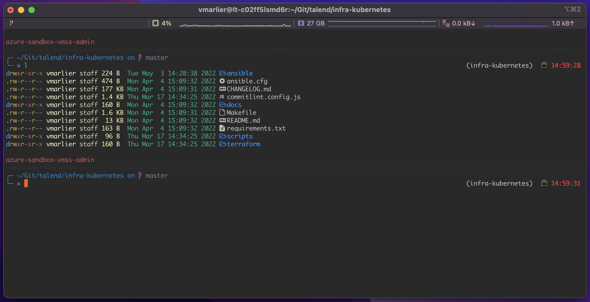
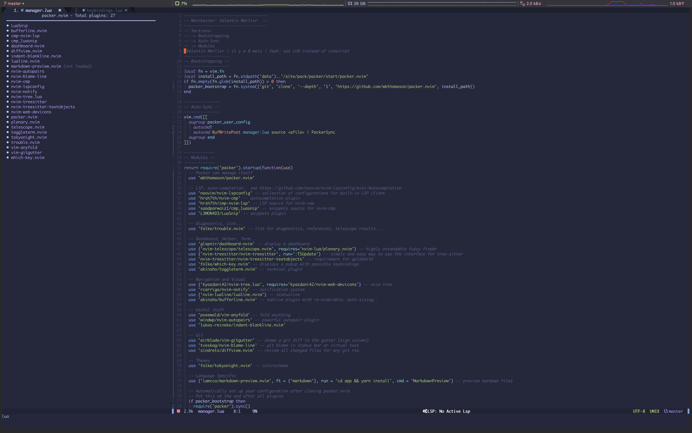
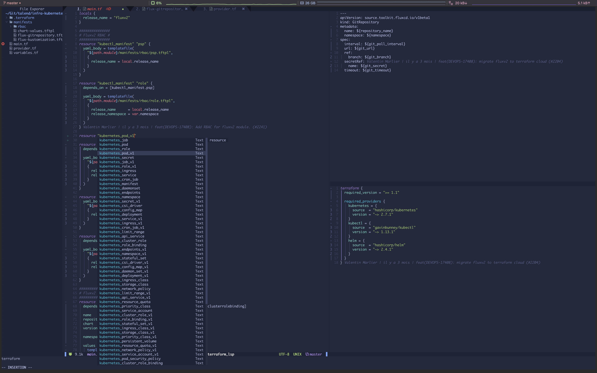

# dotfiles
My zsh, nvim, iterm2 config and a makefile to automatically setup everything

## Screenshots

What my iTerm look like with a custom zsh theme (af-magic-reloaded) and some stuff to ease my daily work (lot of Git and K8S interactions).

Here is my NeoVim plugins configuration written in Lua and managed by Packer.

A quick example of what my NeoVim looks like in practice with native completion (Neovim 0.7.0).

