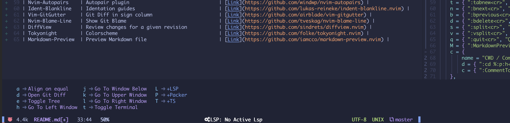

# NVim configuration

- [Basic Info](#basic-info)
- [Folder Organization](#folder-organization)
- [Keybindings](#keybindings)
- [Plugins](#plugins)

## Basic Info

| Package | Installer | Version |
|---------|-----------|---------|
| Neovim  | ASDF      | v0.7.0  |
| Neovim  | NPM       | v18.2.0 |
| Neovim  | Pip3      | v0.3.1  |
| Neovim  | Ruby      | v0.8.1  |

## Folder Organization

Since I am using Lua to configured my Neovim installation, I had to rethink the way my configuration folder is organized.
Here is a little diagram to explain this new layout:
```sh
├── README.md
├── init.lua                    # main file that neovim is looking for. Bring together all the sub-configuration files.
├── lua                         
│   ├── au.lua                  # permit to continue to use autocommands on LUA configuration.
│   ├── keybindings.lua         # file where keybindings are defined with the help of the which-key plugin.
│   ├── manager.lua             # packer file, where I keep all my plugins.
│   ├── plugins-settings.lua    # configuration for all the plugins installed in the file above.
│   └── settings.lua            # basic vim configuration file (replacement for my old init.vim).
└── templates
    ├── template.rep.md         # template file for taking quick notes during meetings.
    └── template.readme.md      # template file for new readme.md files.
```

## Keybindings

Here is a list of all my keybindings.
I don't use them all on a daily basis, that's why which-key is really helpful.



> Plugin related keybindings

| Space Combination | Action |
|-------------|--------|
| space + t   | Open a Terminal |
| space + e   | Toggle Navigation Tree |
| space + d   | Open Git Diff View |
| space + a   | Align Elements on "=" |
| space + j   | Move to buffer below |
| space + k   | Move to buffer above |
| space + h   | Move to left buffer |
| space + l   | Move to right buffer |
| space + P + c   | PackerCompile |
| space + P + r   | PackerClean |
| space + P + i   | PackerInstall |
| space + P + u   | PackerUpdate |
| space + P + s   | PackerUpdate + PackerCompile |
| space + P + l   | Helper to loads optional package |
| space + T + s   | Show Installed TreeSitter Modules |
| space + L + i   | Show information on active LSP |

> Telescope related keybindings

| TAB Combination | Action |
|-------------|--------|
| tab + t     | Open Telescope |
| tab + r     | Relative Numbering On/Off |
| tab + s + f | Find Files |
| tab + s + g | Grep in files |
| tab + f + b | File Browser |
| tab + f + g | Git Files |
| tab + g + c | Git Commit |
| tab + g + s | Git Status |
| tab + g + b | Git Branches |
| tab + d + t | Toggle Trouble Plugin |

> Movement and useful feature keybindings

| Leader Combination | Action |
|-------------|--------|
| , + n       | Next Buffer |
| , + p       | Previous Buffer |
| , + d       | Delete Current Buffer |
| , + s       | Split Window Horizontaly |
| , + v       | Split Window Verticaly |
| , + q       | Quit |
| , + M       | Preview Markdown File |
| , + t + t   | Create New Tab | 
| , + t + n   | Next Tab | 
| , + t + p   | Previous Tab | 
| , + t + c   | Close Tab | 
| , + c + d   | Switch CWD to the directory of the active buffer | 
| , + c + c   | (Un)Comment Line | 
| , + y + n   | Substitute with newer paste | 
| , + y + p   | Substitute with older paste| 

> Buffers, Windows and Tabs can be a bit messy for new vim users.
> Here is a quick reminder to help you:

> "Tabs are containers for windows, and windows are themselves also containers, but for buffers.".
> Thus, you can edit files through buffers, and open multiple buffers (or the same one multiple times) across windows (Splits).
> Then, you can have different tabs containing some windows that display buffers which allow us to interact with files.

## Plugins

| Plugin | Purpose | Link |
|--------|---------|------|
| Packer            | Plugin Management                             | [Link](https://github.com/wbthomason/packer.nvim) |
| Nvim-lspconfig    | Collection of configurations for LSP clients  | [Link](https://github.com/neovim/nvim-lspconfig) |
| Nvim-cmp          | Autocompletion plugin                         | [Link](https://github.com/hrsh7th/nvim-cmp) |
| Cmp-nvim-lsp      | LSP source for nvim-cmp                       | [Link](https://github.com/hrsh7th/cmp-nvim-lsp) |
| Cmp-path          | Nvim-cmp source for filesystem paths          | [Link](https://github.com/hrsh7th/cmp-path) |
| Cmp_luasnip       | Snippets source for nvim-cmp                  | [Link](https://github.com/saadparwaiz1/cmp_luasnip) |
| LuaSnip           | Snippets                                      | [Link](https://github.com/L3MON4D3/LuaSnip) |
| Trouble.nvim      | Diagnostics                                   | [Link](https://github.com/folke/trouble.nvim) |
| Dashboard.nvim    | Display a Dashboard                           | [Link](https://github.com/glepnir/dashboard-nvim) |
| Telescope.nvim    | Fuzzy finder                                  | [Link](https://github.com/nvim-telescope/telescope.nvim) |
| Plenary           | Dependency for Telescope                      | [Link](https://github.com/nvim-lua/plenary.nvim) |
| Treesitter        | Easy use of treesitter                        | [Link](https://github.com/nvim-treesitter/nvim-treesitter) |
| Which-Key         | Keybindings                                   | [Link](https://github.com/folke/which-key.nvim) |
| ToggleTerm        | Terminal                                      | [Link](https://github.com/akinsho/toggleterm.nvim) |
| Nvim-Tree         | Simple Tree Explorer                          | [Link](https://github.com/kyazdani42/nvim-tree.lua) |
| Nvim-web-devicons | Add devicons support                          | [Link](https://github.com/kyazdani42/nvim-web-devicons) |
| Nvim-Notify       | Notification system                           | [Link](https://github.com/rcarriga/nvim-notify) |
| LuaLine           | Statusline                                    | [Link](https://github.com/nvim-lualine/lualine.nvim) |
| Bufferline        | Tabline                                       | [Link](https://github.com/akinsho/bufferline.nvim) |
| Vim-Anyfold       | Fold Anything                                 | [Link](https://github.com/pseewald/vim-anyfold) |
| Nvim-Autopairs    | Autopair plugin                               | [Link](https://github.com/windwp/nvim-autopairs) |
| Ident-Blankline   | Identation guides                             | [Link](https://github.com/lukas-reineke/indent-blankline.nvim) |
| Vim-GitGutter     | Git Diff in sign column                       | [Link](https://github.com/airblade/vim-gitgutter) |
| Nvim-Blame-Line   | Show Git Blame                                | [Link](https://github.com/tveskag/nvim-blame-line) |
| DiffView          | Review changes for a given revision           | [Link](https://github.com/sindrets/diffview.nvim) |
| Tokyonight        | Colorscheme                                   | [Link](https://github.com/folke/tokyonight.nvim) |
| Markdown-Preview  | Preview Markdown file                         | [Link](https://github.com/iamcco/markdown-preview.nvim) |
